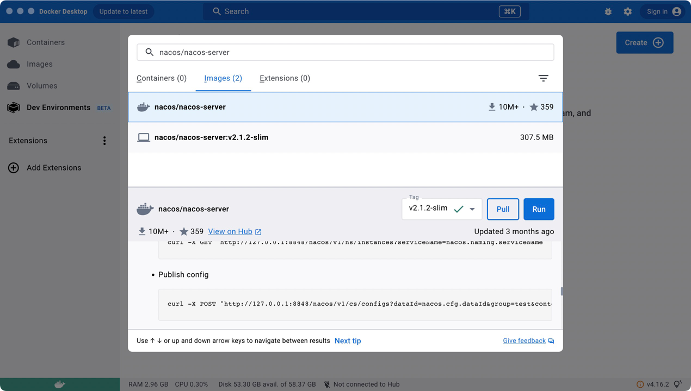

## 使用docker方式安装nacos

1. 数据库
   使用本地mysql，先创建数据看nacos_config
   执行sql：https://github.com/alibaba/nacos/blob/master/distribution/conf/mysql-schema.sql

2. 镜像拉取
   

3. 镜像启动
   docker run -it --name nacos-server -p 8848:8848 -p 9848:9848 -p 9849:9849 -e MODE=standalone  -e SPRING_DATASOURCE_PLATFORM=mysql -e MYSQL_SERVICE_HOST=localhost -e MYSQL_SERVICE_PORT=3306 -e MYSQL_SERVICE_USER=scallion -e MYSQL_SERVICE_PASSWORD=scallion2022 -e MYSQL_SERVICE_DB_NAME=nacos-config -e TIME_ZONE='Asia/Shanghai' -d nacos/nacos-server:v2.1.2-slim
   由于macbook是 --platform linux/arm64/v8而nacos镜像是 --platform linux/amd64  
   切换镜像  
   docker run -it --name nacos-server -p 8848:8848 -p 9848:9848 -p 9849:9849 -e MODE=standalone  -e SPRING_DATASOURCE_PLATFORM=mysql -e MYSQL_SERVICE_HOST=localhost -e MYSQL_SERVICE_PORT=3306 -e MYSQL_SERVICE_USER=scallion -e MYSQL_SERVICE_PASSWORD=scallion2022 -e MYSQL_SERVICE_DB_NAME=nacos-config -e TIME_ZONE='Asia/Shanghai' -d zhusaidong/nacos-server-m1:2.0.3

## 参考
https://blog.csdn.net/qq991658923/article/details/128050862

